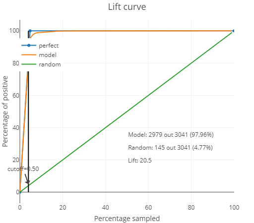
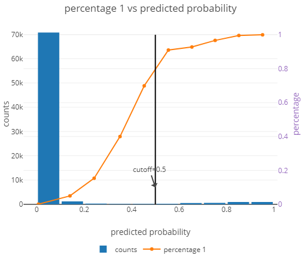
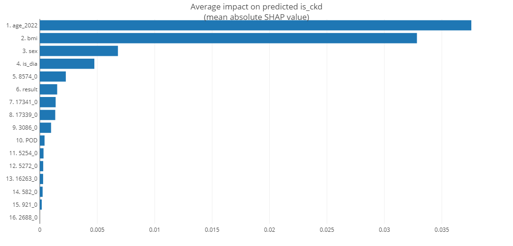

# EHH Ettioled Challenge 6
This is code repository for the European Healthcare Hackathon from 26.11.2022 for challeng #6

## Challenge description
Chronical Kidney Disease (CKD) in late stages has huge human and financial cost, including regular dialysis, 
costly medications and in late stages transplantation (in better case) or death. The main challenges with
CKD are:

- Chronical Kidney Disease (CKD) involves gradual loss of kidney function. It can progress to end-stage kidney failure, which is fatal without artificial filtering (dialysis) or a kidney transplant and is linked to other health complications. As CKD progresses, it affects the quality of life for the patients as the late stages of the disease requires dialysis.
- Each patient that requires dialysis costs  approx. 1 million CZK, inducing costs of 6 billions CZK per year with more than 6,000 dialysis patients in 2021. 
- Research made CDC (Center for Disease Control and Prevention) claims the disease affects more than 15% of the population. As the disease probability is linked to age, the number of people suffering from it will only increase.
- There is little prevention and education w.r.t. CKD, which results to the disease being identified in later stages, where it already is life threatening and requires costly treatments.
- If identified early, the medications available can significantly slow down the progression. 

## Proposed goals and solution 

Using data, we aim to identify people prone to having CKD to detect the disease as early as possible using 
most prevalent test and baseline information like age or bmi to enable simple indentification at early stage
for more descriptive tests.

We have used IKEM data to build predictive model that would predict whether the patient has CKD based on laboratory
results.  We have employed Machine Learning and Data Science to come up with a solution that helps determine risky 
patients together with a strategy which would target and incentivize groups at risk. 
Our predictive model can accurately determine a CKD patient by identifying core subgroup of 20% in our data
which contained 99%

As you can see from the lift curve above the model was able to correctly identify nearly whole CKD population. 
From the following figure we have identified that when we use cut-off 0.5 we reach above 90% accuracy.

## Data 

For this challenge we got anonymized data from IKEM containing test results and list of diagnoses including CKD. 

### Preparation and exploration

For data exploration we have used pandas_explain module which provides comprehensive reports about data.
One of our goals in the data preparation was to aggregate tests into single NCLP code as in essence they 
measure the same metrics. 

**Laboratory dataset**

Full data exploration results for laboratory test can be found it this dashboard 
[Laboratory data report](./documentation/labs_data_report.html) where you can see that we have evenly distributed
data across time. As a main data feature from this code we have selected NCLP code which corresponds to state code
for specific test. From our exploratory dashboard we can see that the NCLP code is present at nearly 90% of entries. 
The missing values were suplemented from the Analyte column based on creating mapping between different names to NCLP code.

After analysing Code feature in the dateset we identified that it contained only test requiered for transplantation procedure.
Thus we concluded that patients with these samples were either in very late stages of CKD or completely healthy,
which are considered as outliers in our usecase thus we opted for removing those entries.

**Diagnoses dataset**

Full data exploration results for diagnosis can be found in this dashboard 
[Diagnosis data report](./documentation/diag_clean.html). In this dataset we can see that the age of participants
is highly concentrated in older population with mean age of 67 years. This can lead to bias to age as a predictor
as in real world with increasing age we get higher tendency for chronical disease. Second finding in this dataset is that 
it may look like we have diagnosis just from 2 years, 2015 and 2022. After consultation with data owner that this could
be caused by the fact that they have selected patients which had entry check (first diagnosis) in 2015 and then add subsequent
cohort of CKD patients from 2022. 

**Synthetic dataset**

The synthetic dataset was our final dataset used for the model training where we have transposed the laboratory
dataset so it could be joined on the diagnosis data. Later this data was stripped of patient IDs as it no longer
served any need. As you can see from the in the report there are already seen some level of corelations and cross
dependencies. One of the most significant is corelation between age and BMI which point to sad realization that with 
higher age we tend to neglect our fitness and this the BMI deteriorates with age.

[Full data report](./documentation/full_data.html).

### Methodology & Sources

NCLP -> https://www2.ikem.cz/plm_lp/_LP_12273-L0000006.htm , https://www2.ikem.cz/plm_lp/HVEZDAADBQ.htm

Literature:
 - https://www.cdc.gov/kidneydisease/pdf/Chronic-Kidney-Disease-in-the-US-2021-h.pdf
 - https://www.frontiersin.org/articles/10.3389/fmed.2022.903090/full
 - https://journalofbigdata.springeropen.com/articles/10.1186/s40537-022-00657-5
 - https://ieeexplore.ieee.org/document/9888564
 - https://link.springer.com/article/10.1007/s44174-022-00027-y
 - https://ieeexplore.ieee.org/document/9185249
 - https://www.nature.com/articles/s41598-022-06665-y
 - https://www.ncbi.nlm.nih.gov/pmc/articles/PMC2649736/
 - https://www.ncbi.nlm.nih.gov/pmc/articles/PMC2649736/figure/F1/
 - https://academic.oup.com/ndt/article/35/9/1527/5369192
 - 

## Model 

We have trained multiple XGBoost classifier models on prepared synthetic data as described in the Data section. One of the 
final models where we have excluded GFR measures (because they are definition of CKD) had as a core predictiors Age,
BMI, Leukocytes in blood, Urea test, Hematocrits and Eurocytes in the blood. The importance of features can be seen on the 
figure below. 

.

This model as it can be seen above had 99% accuracy as shown in the solution section.

### Further suggestions

- Employ different models and incentives based on the probability:
   - Group 1 (age < 40) : Early Detection - educate and use available data without forcing additional tests (e.g. BMI, 
   - Group 2 (age 40 - 65) : Riskier - Identify “available” tests that have predictive power w.r.t. to CKD, incentivize people to test and report the results
   - Group 3 (age >65) : High alert - Incentivize people to undergo specialized tests that determine the disease.
- Further normalization of dataset
  - For example there are multiple occurances of the same test measures which can be consolidated into single value and increase predictive ability of model
- Train model on whole dataset or specific tests based on expert recommendation
  - Here we could aim for test which can be cost effective and simple to evaluate
- Further explore different models 
  - For example SVM or Random-Forest or self-training models like Reinforcement learning to discover strategy for CKD identifications
- Define education strategy
   
## Authors

Pavel Milicka - pmilicka (at) deloittece.com
Kajetan Poliak - kpoliak (at) deloittece.com
Matej Marcisin - mmarcisin (at) deloittece.com
